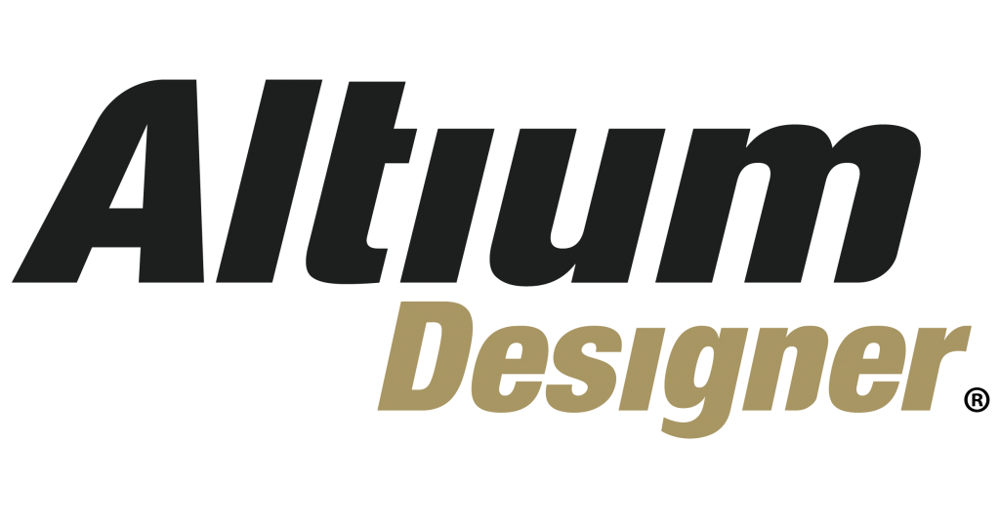

  

  ## Documentación sobre el uso de Altium Designer y sus diferentes herramientas 

> [!NOTE]
> ### ¿Qué es Altium Designer?
> Altium Designer es una solución integral diseñada para todo el espectro de proyectos de PCB, desde un circuito básico hasta complejos sistemas multiplaca. Con las herramientas adecuadas para gestionar reglas de diseño, enrutamiento avanzado, rígido-flexible, HDI, alta velocidad o lo que se te ocurra, tu equipo puede trabajar con eficacia y evitar costes adicionales en software adicional, por muy avanzado que sea un proyecto.

> Dispone de todas las funcionalidades necesarias para gestionar, acceder y sincronizar los datos de diseño de PCB 

por lo que es una herramienta ideal para prevenir problemas derivados de estos datos, como retrasos en el diseño o incidencias relacionadas con la calidad. Además, con la plataforma basada en la nube `Altium 365`, podrás gestionar sin esfuerzo tus datos de diseño en un espacio seguro y sometido al control de versiones, con acceso a información actualizada sobre componentes y cadena de suministro
